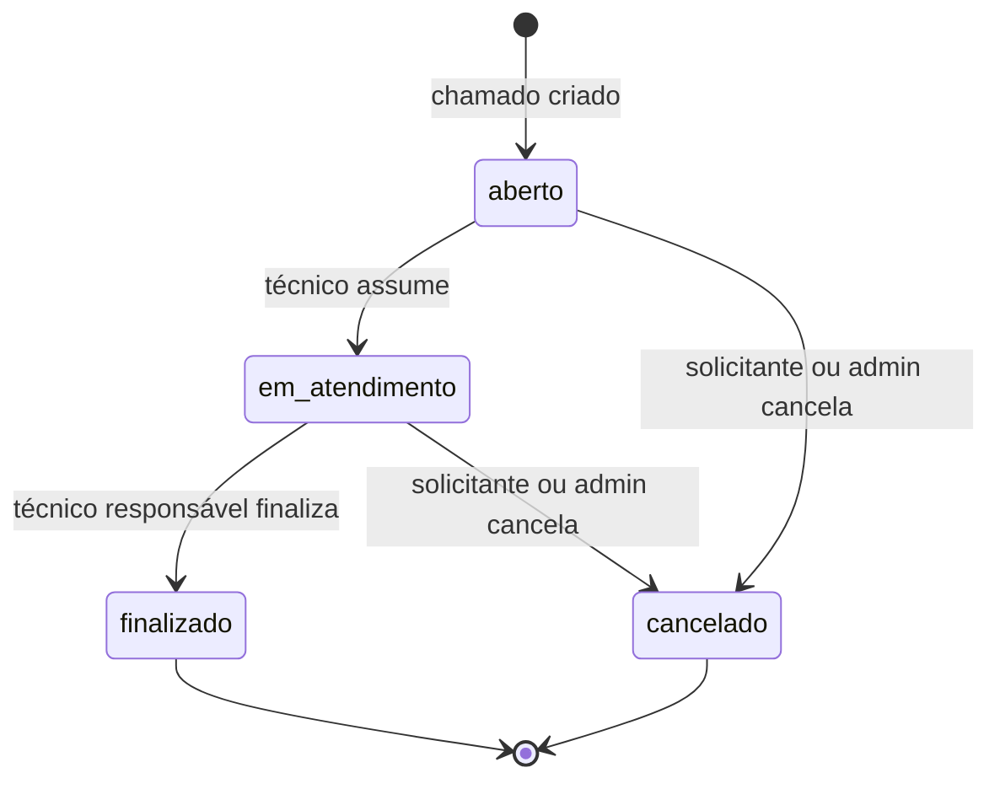

# Helpdesk API

<p align="center">
  API REST para gerenciamento do ciclo de vida de chamados de suporte, desenvolvida com Laravel.
</p>

<p align="center">
  
  
  
  
</p>

## Sobre o projeto

O **Helpdesk API** é um backend para controle de chamados técnicos. A aplicação permite cadastrar categorias, abrir chamados, atribuí-los a técnicos, adicionar comentários, finalizar ou cancelar atendimentos e consultar o histórico das operações.

O projeto foi construído para praticar organização de uma aplicação Laravel com **Controllers**, **Form Requests**, **Actions**, **Eloquent**, **transações de banco de dados** e **testes de Feature**.

### Frontend

A interface web do projeto está em desenvolvimento em um repositório separado:

**[github.com/erikgdl/helpdesk-front](https://github.com/erikgdl/helpdesk-front)**

## Funcionalidades

- CRUD de categorias;
- CRUD de chamados;
- abertura de chamado com status, data e histórico definidos automaticamente;
- atribuição de chamado a um usuário do tipo `tecnico`;
- comentários vinculados ao chamado e registrados no histórico;
- finalização exclusiva pelo técnico responsável;
- cancelamento pelo solicitante responsável ou por um administrador;
- consulta de chamados com solicitante, técnico, categoria, comentários e histórico;
- validação de payloads por meio de Form Requests;
- transações nas principais operações do domínio;
- testes automatizados para todos os fluxos atualmente implementados.

## Regras de negócio implementadas

### Ciclo do chamado



- Todo chamado nasce como `aberto`, sem técnico e com a data de abertura preenchida.
- Somente um usuário com tipo `tecnico` pode assumir um chamado aberto.
- Ao ser assumido, o chamado passa para `em_atendimento`.
- Somente o técnico vinculado pode finalizar um chamado em atendimento.
- Chamados `finalizado` ou `cancelado` não aceitam novos comentários.
- Um chamado pode ser cancelado pelo seu solicitante ou por um usuário `admin`.
- Chamados finalizados não podem ser cancelados e chamados cancelados não podem ser cancelados novamente.
- Criação, atribuição, comentário, finalização e cancelamento geram registros de histórico.

As prioridades aceitas são: `baixa`, `media`, `alta` e `urgente`.

## Tecnologias

| Tecnologia | Uso |
|---|---|
| PHP 8.2+ | Linguagem principal |
| Laravel 12 | Framework da aplicação e da API |
| Eloquent ORM | Persistência e relacionamentos |
| SQLite | Banco padrão local e banco em memória nos testes |
| PHPUnit 11 | Testes automatizados |
| Laravel Pint | Padronização de código PHP |

## Arquitetura

As operações principais seguem o fluxo:

```text
Request HTTP
    └── Route
        └── Controller
            └── Form Request (validação)
                └── Action (regra de negócio + transação)
                    └── Model / Eloquent
                        └── Banco de dados
```

```text
app/
├── Actions/             # Casos de uso e regras do ciclo dos chamados
├── Http/
│   ├── Controllers/     # Entrada HTTP e respostas JSON
│   └── Requests/        # Validação dos payloads
└── Models/              # Entidades e relacionamentos Eloquent

database/
├── factories/           # Factory de usuários
├── migrations/          # Estrutura das tabelas
└── seeders/             # Dados iniciais

docs/                    # Documentação de desenvolvimento
routes/api.php           # Rotas da API
tests/                   # Testes automatizados da API
```

### Entidades

| Entidade | Responsabilidade |
|---|---|
| `User` | Solicitante, técnico ou administrador |
| `Categoria` | Classificação de um chamado |
| `Chamado` | Dados e estado do atendimento |
| `Comentario` | Interações realizadas no chamado |
| `HistoricoChamado` | Registro das ações e transições relevantes |

## Como executar localmente

### Pré-requisitos

- PHP `8.2` ou superior;
- Composer;
- extensão PDO do banco escolhido;
- para a configuração padrão, extensões `pdo_sqlite` e `sqlite3`.

### Instalação

```bash
# instale as dependências PHP
composer install

# crie o arquivo de ambiente
php -r "file_exists('.env') || copy('.env.example', '.env');"

# gere a chave da aplicação
php artisan key:generate

# crie o arquivo SQLite, caso ainda não exista
php -r "file_exists('database/database.sqlite') || touch('database/database.sqlite');"

# crie as tabelas e os dados iniciais
php artisan migrate --seed

# inicie a API
php artisan serve
```

A aplicação ficará disponível, por padrão, em `http://127.0.0.1:8000` e a API em `http://127.0.0.1:8000/api`.

O seeder atual cria o usuário:

| Campo | Valor |
|---|---|
| Nome | `Test User` |
| E-mail | `test@example.com` |
| Senha da factory | `password` |
| Tipo | `solicitante` |

Para experimentar atribuição e cancelamento administrativo, crie usuários dos tipos `tecnico` e `admin` via Tinker ou diretamente no ambiente local.

Exemplo com Tinker:

```bash
php artisan tinker
```

```php
App\Models\User::factory()->create([
    'name' => 'Tecnico Local',
    'email' => 'tecnico@example.com',
    'tipo' => 'tecnico',
]);

App\Models\User::factory()->create([
    'name' => 'Admin Local',
    'email' => 'admin@example.com',
    'tipo' => 'admin',
]);
```

## Referência da API

Envie os cabeçalhos abaixo nas requisições com corpo JSON:

```http
Accept: application/json
Content-Type: application/json
```

### Categorias

| Método | Endpoint | Descrição |
|---|---|---|
| `GET` | `/api/categorias` | Lista as categorias |
| `POST` | `/api/categorias` | Cria uma categoria |
| `GET` | `/api/categorias/{id}` | Exibe uma categoria |
| `PUT/PATCH` | `/api/categorias/{id}` | Atualiza uma categoria |
| `DELETE` | `/api/categorias/{id}` | Exclui uma categoria |

<details>
<summary><strong>Payload para criar ou atualizar uma categoria</strong></summary>

```json
{
  "nome": "Infraestrutura",
  "descricao": "Problemas de rede, máquinas e periféricos"
}
```

`nome` é obrigatório. `descricao` pode ser nula.

</details>

### Chamados

| Método | Endpoint | Descrição |
|---|---|---|
| `GET` | `/api/chamados` | Lista chamados e relacionamentos |
| `POST` | `/api/chamados` | Abre um chamado |
| `GET` | `/api/chamados/{id}` | Exibe um chamado e seus relacionamentos |
| `PUT/PATCH` | `/api/chamados/{id}` | Atualiza os dados básicos do chamado |
| `DELETE` | `/api/chamados/{id}` | Exclui fisicamente o chamado |
| `POST` | `/api/chamados/{id}/assumir` | Atribui um técnico ao chamado |
| `POST` | `/api/chamados/{id}/comentarios` | Adiciona um comentário |
| `POST` | `/api/chamados/{id}/finalizar` | Finaliza o atendimento |
| `POST` | `/api/chamados/{id}/cancelar` | Cancela o chamado |

#### Abrir chamado

```http
POST /api/chamados
```

```json
{
  "titulo": "Sem acesso ao sistema",
  "descricao": "A aplicação informa que minhas credenciais são inválidas.",
  "prioridade": "alta",
  "usuario_id": 1,
  "categoria_id": 1
}
```

A API ignora qualquer tentativa de definir o estado inicial: `status` será `aberto`, `tecnico_id` será `null` e `data_abertura` será preenchida no servidor. Em caso de sucesso, a resposta usa o status HTTP `201 Created`.

#### Atualizar chamado

```http
PUT /api/chamados/1
```

```json
{
  "titulo": "Sem acesso ao sistema interno",
  "descricao": "O erro continua acontecendo em diferentes navegadores.",
  "prioridade": "urgente",
  "usuario_id": 1,
  "categoria_id": 1
}
```

Nas atualizações com `PUT` ou `PATCH`, envie todos os campos mostrados acima.

#### Assumir chamado

```http
POST /api/chamados/1/assumir
```

```json
{
  "tecnico_id": 2
}
```

O usuário informado deve existir e possuir o tipo `tecnico`. O chamado deve estar `aberto` e sem técnico responsável.

#### Adicionar comentário

```http
POST /api/chamados/1/comentarios
```

```json
{
  "usuario_id": 2,
  "mensagem": "Estamos analisando o problema."
}
```

#### Finalizar chamado

```http
POST /api/chamados/1/finalizar
```

```json
{
  "tecnico_id": 2
}
```

O chamado deve estar `em_atendimento`, e o ID deve pertencer ao técnico responsável.

#### Cancelar chamado

```http
POST /api/chamados/1/cancelar
```

```json
{
  "usuario_id": 1
}
```

O ID deve pertencer ao solicitante responsável pelo chamado ou a um administrador.

### Respostas e erros

- recursos criados retornam `201 Created`;
- operações bem-sucedidas retornam JSON com o recurso atualizado;
- payloads inválidos ou violações das regras retornam `422 Unprocessable Entity`;
- IDs não encontrados por route model binding retornam `404 Not Found`;
- exclusões retornam uma mensagem de confirmação.

## Testes e qualidade

Os testes estão configurados para usar SQLite em memória:

```bash
composer test
```

Ou diretamente:

```bash
php artisan test
```

A suíte atual possui **36 testes e 165 assertions**, distribuídos entre:

- CRUD e validações de categorias;
- CRUD, relacionamentos e estado inicial dos chamados;
- atribuição de técnicos;
- comentários e vínculo correto com o histórico;
- finalização de chamados;
- cancelamento e regras de permissão atuais;
- respostas de erro, registros no banco e efeitos em cascata.

Para formatar o código PHP:

```bash
vendor/bin/pint
```

> [!NOTE]
> É necessário habilitar `pdo_sqlite` e `sqlite3` no PHP usado pelo terminal. Sem essas extensões, os testes que acessam o banco falham com `could not find driver`.

## Documentação

As notas de desenvolvimento e o planejamento técnico estão em [`docs/`](docs/README.md).

---

<p align="center">
  Desenvolvido como projeto de estudo de Laravel e construção de APIs REST.
</p>
